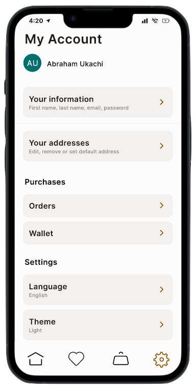
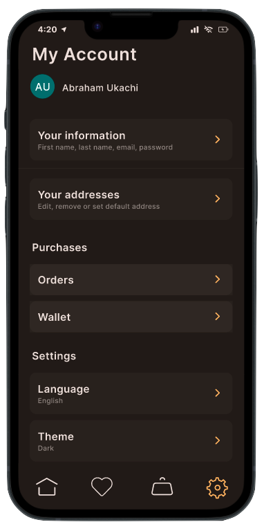
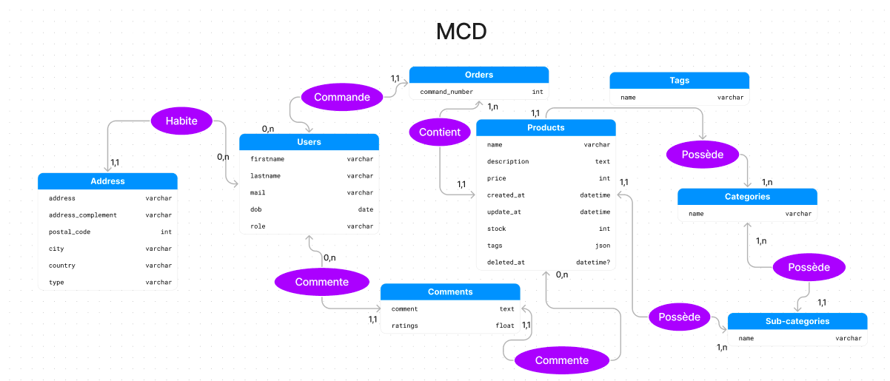
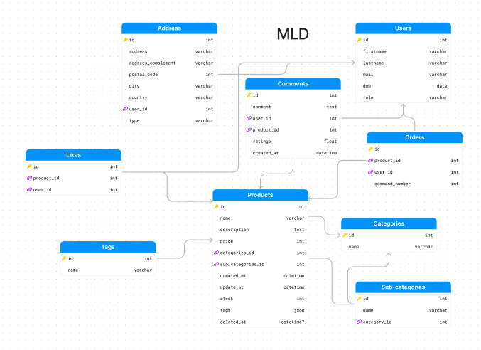
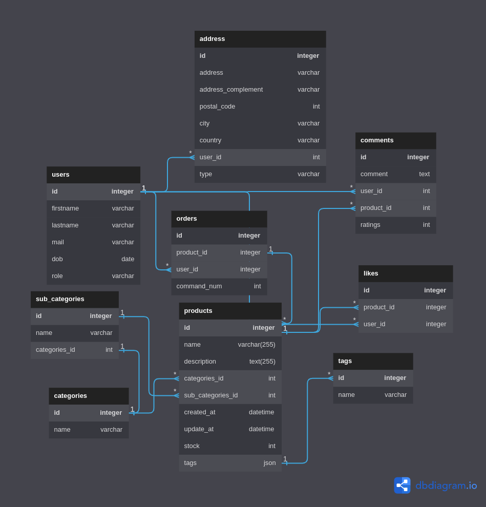

<p align="center">
  <!-- Light Mode for Maxaboom logo -->
  <a href="https://abraham-ukachi.students-laplateforme.io/boutique-en-ligne/#gh-light-mode-only" target="_blank">
     
  </a>

  <!-- Light Mode for Maxaboom logo -->
  <a href="https://abraham-ukachi.students-laplateforme.io/boutique-en-ligne/#gh-dark-mode-only" target="_blank">
     
  </a>

</p>

<p align="center">
  Maxaboom 🎶 is a <b>fun</b> and <b>dynamic</b> online store that offers a wide variety of musical instruments. <br> From guitars 🎸 and drums 🥁 to keyboards 🎹, microphones 🎙 and trumpets 🎺, Maxaboom has everything a musician needs to create their own unique sound. With high-quality products and exceptional customer service; a perfect destination for anyone looking to unleash their inner rockstar.
</p>

<p align="center">
    <a href="https://abraham-ukachi.students-laplateforme.io/boutique-en-ligne" target="_blank"><b>Checkout Maxaboom &rarr;</b></a>
</p>

---

# `boutique-en-ligne`

> IMPORTANT: This is a working progress and subject to major changes until the specified deadline below.

A school project to create an **online shop** using `JavaScript` with a fully functioning `MySQL` database.

This project is to be done by a group of ~~3~~ 4 (including [me](https://github.com/abraham-ukachi)), and my partners / collaborators for the next 3-4 weeks are [Axel Vair](https://github.com/axel-vair), [Morgane Marechal](https://github.com/morgane-marechal) and [Catherine Tranchand](https://github.com/catherine-tranchand) (our latest member).

So, we've decided to name our online shop 🥁... "**`MaxaBoom`**" (♾💥), and will a MySQL Database named **`db_maxaboom.sql`**. 

**Why `MaxaBoom` you might ask?** #GoodQuestion !-: This is just a play-on-words with our first names and/or nicknames: **Ax**el + **Ab**raham + **Momo** (Morgane) === **MaxaBoom** 😜


The following tables (including a couple of TRIGGERS) were created in our **`db_maxaboom.sql`** database:

1. [*`users`*](#users---MySQL-Table): All currently registered users.
2. [*`products`*](#products---MySQL-Table): All producs created by the seller or administrator.
3. [*`categories`*](#categories---MySQL-Table): All categories of corresponding products.
4. [*`sub_categories`*](#sub_categories---MySQL-Table): All sub-categories related to product categories.
5. [*`tags`*](#tags---MySQL-Table): All tags applied to each product.
6. [*`addresses`*](#addresses---MySQL-Table): All addresses of the registered users.
7. [*`comments`*](#comments---MySQL-Table): All comments (or reviews) made by users (or reviews) on all products.
8. [*`orders`*](#orders---MySQL-Table): All orders of users.
9. [*`likes`*](#likes---MySQL-Table): All likes of corresponding products.
10. [*`cart`*](#): The customers' cart

> NOTE: For more info, [read the Database section](#Database) of this *README*. 


## Description 
> Original text in French: Votre entreprise décide de mettre en place une boutique en ligne (Thème et produits au choix).

Your company decides to set up an online shop (Theme and products to choose from).

## Requirements

These are a couple of the main requirements for this school project:

1. An well-designed / attractive **homepage** with several sections including a **highlighting of flagship products** on the homepage / latest products put online.

2. Contemporary design and respecting the **graphic charter** of your company
3. The site must be **responsive**!
4. Product **search bar** with autocompletion in asynchronous javascript
5. Access to the shop presenting all the products with the possibility of **filtering them by category / subcategories without page reloading**.
6. On clicking on each product: a complete **“detail” page** dynamically generated (name, image, price, description, add to cart button, etc.)
7. A system for creating **user accounts**:
    - Registration / Connection module **_(Use of Javascript and Asynchronous mandatory in this part)_**
    - User profile management page (Summary and possibility to modify information, view purchase history, basket consultation, etc.)
8. **Administrator dashboard area**:
    - Product management using back office (Addition / Deletion / Modification of products, stocks, etc.)
    - Management of categories and subcategories of products (Addition / Deletion / Modifications…)
9. **Cart / basket validation system** (You do not have to implement a real payment solution, a simulation of the process is enough)

> NOTE: 

## Target Skills

- Project / application modeling
- MCD / MLD database design
- Object Oriented Programming: use of Classes
- Detail a user journey on a “business” feature of your site (purchase action…)
- Structuring a project and thinking about its architecture
- Do asynchronous with JS
- Pitching a project: oral expression / production of presentation slides 


## Jobs
> MOTTO: We'll always do [**more**](#More) 😜

The official deadline of the jobs below - according to [intra](https://intra.laplateforme.io) - is **26-04-2023 at 09:25 A.M**. Here is a list of all the specific files to be submitted as well as their corresponding / current **status** for this project:

| No. | Name | File | Status |
|:----|:-----|:-----|:-------|
| 1 | *`Splash Screen - View`* | **splash-screen.php** | Pending |
| 2 | *`Welcome Screen - View`* | **welcome-screen.php** | Pending |
| 3 | *`Home Page - View`* | **home-page.php** | *_In progress_* |
| 4 | *`Maxaboom Database - SQL`* | **db_maxaboom.sql** | [Done](./db_maxaboom.sql) |
| 5 | *`Shop Page - View`* | **shop-page.php** | *_In progress_* |
| 6 | *`Product Page - View`* | **product-page.php** | *_In progress_* |
| 7 | *`Color - Theme`* | **color.css** | [Done](./assets/theme/color.css)\* |
| 8 | *`Typography - Theme`* | **typography.css** | [Done](./assets/theme/typography.css)\* |
| 9 | *`Styles - Theme`* | **styles.css** | *_In progress_* |
| 10 | *`Home - Controller`* | **HomeController.php** | [Done](./controllers/HomeController.php)\* | 
| 11 | *`Admin - Controller`* | **AdminController.php** | [Done](./controllers/AdminController.php)\* | 
| 12 | *`Shop - Controller`* | **ShopController.php** | [Done](./controllers/ShopController.php)\* | 
| 13 | *`Product - Controller`* | **ProductController.php** | [Done](./controllers/ProductController.php)\* | 
| 14 | *`Order - Controller`* | **OrderController.php** | *_In progress_* | 
| 15 | *`Cart - Controller`* | **CartController.php** | [Done](./controllers/CartController.php)\* | 
| 16 | *`Category - Controller`* | **CategoryController.php** | Pending | 
| 17 | *`Checkout - Controller`* | **CheckoutController.php** | *_In progress_* | 
| 18 | *`Profile - Controller`* | **ProfileController.php** | Pending | 
| 19 | *`Product - Controller`* | **ProductController.php** | ~~Pending~~ | 
| 20 | *`Settings - Controller`* | **SettingsController.php** | ~~Pending~~ | 
| 21 | *`Payment - Controller`* | **PaymentController.php** | Pending | 
| 22 | *`Address - Controller`* | **AddressController.php** | Pending | 
| 23 | *`User - Model`* | **User.php** | [Done](./models/User.php)\* | 
| 24 | *`Order - Model`* | **Order.php** | *_In progress_* | 
| 25 | *`Review - Model`* | **Review.php** | [Done](./models/Review.php)\* | 
| 26 | *`Product - Model`* | **Product.php** | [Done](./models/Product.php)\* | 
| 27 | *`Cart - Model`* | **Cart.php** | [Done](./models/Cart.php)\* | 
| 28 | *`Image - Model`* | **Image.php** | ~~Pending~~ | 
| 29 | *`Category - Model`* | **Category.php** | [Done](./models/Category.php)\* | 
| 30 | *`Address - Model`* | **Address.php** | [Done](./models/Address.php)\* | 
| 31 | *`Tag - Model`* | **Tag.php** | ~~Pending~~ | 
| 32 | *`Account - Controller`* | **AccountController.php** | *_In progress_* | 
| 33 | *`API - Controller`* | **APIController.php** | *_In progress_* | 
| 34 | *`Nav Bar - View Component`* | **nav-bar.php** | [Done](./views/components/nav-bar.php)\* | 
| 35 | *`Footer - View Component`* | **footer.php** | Pending | 
| 36 | *`App Bar - View Component`* | **app-bar.php** | ~~Pending~~ | 
| 37 | *`Database - Model Helper`* | **Database.php** | [Done](./models/helpers/Database.php)\* | 
| 38 | *`Response - Controller Helper`* | **ResponseHandler.php** | [Done](./contollers/helpers/ResponseHandler.php)\* | 
| 39 | *`Home - Route`* | **home-route.php** | [Done](./routes/home-route.php)\* | 
| 40 | *`Shop - Route`* | **shop-route.php** | [Done](./routes/shop-route.php)\* | 
| 41 | *`Order - Route`* | **order-route.php** | *_In progress_* | 
| 42 | *`Product - Route`* | **product-route.php** | [Done](./routes/product-route.php)\* | 
| 43 | *`Side Bar - View Component`* | **side-bar.php** | [Done](./views/components/side-bar.php)\* | 
| 44 | *`Admin - Route`* | **admin-route.php** | [Done](./routes/admin-route.php)\* | 
| 45 | *`Account - Route`* | **account-route.php** | [Done](./routes/account-route.php)\* | 
| 46 | *`Cart - Route`* | **cart-route.php** | [Done](./routes/cart-route.php)\* | 

> WARNING: This list is a working progress and will change soon

> NOTE: (\*) = still needs to be updated


## Structure

The **`MVC`** folder & file structure of this project:

- [**models**](./models/)
- - [**helpers**](./models/helpers/)
- - * *Database.php*
- - * ...
- - *User.php*
- - *Product.php*
- - *Cart.php*
- - *Order.php*
- - ...
- [**views**](./views/)
- - [**components**](./views/components/)
- - * *nav-bar.php*
- - * *app-bar.php*
- - * *footer.php*
- - * ... 
- - *splash-screen.php*
- - *welcome-screen.php*
- - *home-page.php*
- - *shop-page.php*
- - *cart-page.php*
- - *checkout-page.php*
- - *product-page.php*
- - *admin-page.php*
- - ...
- [**controllers**](./controllers/)
- - [**helpers**](./controllers/helpers/)
- - * *Controller.php*
- - * *I18n.php*
- - * *ResponseHandler.php*
- - * ...
- - *UserController.php*
- - *HomeController.php*
- - *ShopController.php*
- - *ProductController.php*
- - *CartController.php*
- - ...
- [**assets**](./assets/)
- - [**logos**](./assets/logos/)
- - [**images**](./assets/images/)
- - ...
- - [**animations**](./assets/animations/)
- - * *fade-in-animation.css*
- - * *pop-in-animation.css*
- - * *slide-from-down-animation.css*
- - [**theme**](./assets/theme/)
- - * *color.css*
- - * *typography.css*
- - * *styles.css*
- - [**stylesheets**](./assets/stylesheets/)
- - * *home-styles.css*
- - * *splash-screen-styles.css*
- - * *login-styles.css*
- - * *register-styles.css*
- - * *profile-styles.css*
- [**src**](./src/)
- - *app.js*
- - *server.js*
- - ...
- - [**helpers**](./src/helpers/)
- - * *mediawatcher.js*
- - * *...*
- - [**scripts**](./src/scripts/)
- - * *home.js*
- - * *checkout.js*
- - * *shop.js*
- - ...
- LICENSE
- README.md
- manifest.json
- package.json
- ...
- **index.php**
- **db_maxaboom.sql**
- *mb_translator.mjs*


> NOTE: This is just a looong snippet ;)


## More 

These are some of the things we did or plan to do, in addition to this project's [job requirements](#Requirements):

| No. | Name | File | Status |
|:----|:-----|:-----|:-------|
| 1 | *`Pop In - Animation`* | **pop-in-animation.css** | [Done](./assets/animations/pop-in-animation.css) |
| 2 | *`Fade In - Animation`* | **fade-in-animation.css** | [Done](./assets/animations/fade-in-animation.css) |
| 3 | *`Slide From Down - Animation`* | **slide-from-down-animation.css** | [Done](./assets/animations/slide-from-down-animation.css) |
| 4 | *`Slide From Up - Animation`* | **slide-from-up-animation.css** | [Done](./assets/animations/slide-from-up-animation.css) |
| 5 | *`Slide Left - Animation`* | **slide-left-animation.css** | [Done](./assets/animations/slide-left-animation.css) |
| 6 | *`Slide From Left - Animation`* | **slide-from-left-animation.css** | [Done](./assets/animations/slide-from-left-animation.css) |
| 7 | *`Slide Right - Animation`* | **slide-right-animation.css** | [Done](./assets/animations/slide-right-animation.css) |
| 8 | *`Slide From Right - Animation`* | **slide-from-right-animation.css** | [Done](./assets/animations/slide-from-right-animation.css) |
| 9 | *`Manifest - JSON File`* | **manifest.json** | [Done](./manifest.json) |
| 10 | *`Package - JSON File`* | **package.json** | [Done](./package.json) |
| 11 | *`Fade Out - Animation`* | **fade-out-animation.css** | [Done](./assets/animations/slide-out-animation.css) |
| 12 | *`Slide Down - Animation`* | **slide-down-animation.css** | [Done](./assets/animations/slide-down-animations.css) |
| 13 | *`Slide Up - Animation`* | **slide-up-animation.css** | [Done](./assets/animations/slide-up-animations.css) |
| 14 | *`Translator - Script`* | **mb_translator.mjs** | [Done](./mb_translator.mjs) |


> NOTE: (\*) = still needs to be updated. <br>
> There's certainly a couple of file we must've forgot or not added yet, so we'll keep the above list updated obv. :)

## Database
> HEADS-UP: We do love me some TRIGGERS, so do not be shocked to see a couple in this database #LOL

The following tables were created in a MySQL database named **`db_maxaboom.sql`** via [PDO](https://www.php.net/manual/en/class.pdo.php) on [phpmyadmin](http://localhost/phpmyadmin):


> NOTE: **`⨁`** = _FOREIGN_KEY_

### `users` - MySQL Table

This table has a [**one-to-many**](https://www.metabase.com/learn/databases/table-relationships#one-to-many-relationship) relationship with [*`addresses`*](#`addresses`---MySQL-Table).

| No. | Name | Type | Length | Null | Default | Extra |
|:----|:-----|:-----|:-------|:-----|:--------|:-------|
| 1 | *`id`* 🔑 | **INT** | 255 | No | None | **AUTO_INCREMENT** | 
| 2 | *`firstname`* | **VARCHAR** | 30 | No | None | - | 
| 3 | *`lastname`* | **VARCHAR** | 30 | No | None | - | 
| 4 | *`email`* | **VARCHAR** | 60 | No | None | - | 
| 5 | *`dob`* | **VARCHAR** | 255 | No | None | - | 
| 6 | *`role`* | **VARCHAR** | 255 | No | None | - |  
| 7 | *`created_at`* | **DATETIME** | - | Yes | NULL | - |  


> NOTE: 


### `products` - MySQL Table

This table has a [**many-to-one**](https://www.metabase.com/learn/databases/table-relationships#many-to-one-relationship) relationship with [*`categories`*](#`categories`---MySQL-Table) table.

| No. | Name | Type | Length | Null | Default | Extra |
|:----|:-----|:-----|:-------|:-----|:--------|:-------|
| 1 | *`id`* 🔑  | **VARCHAR** | 30 | No | None | - |
| 2 | *`category_id`* ⨁ | **TINYINT** | 10 | No | None | - |
| 3 | *`author_id`* ⨁ | **INT** | 255 | No | None | - |
| 4 | *`cover_image_id`* ⨁ | **INT** | 255 | No | None | - |
| 5 | *`title`* | **VARCHAR** | 60 | No | None | - |
| 6 | *`text`* | **TEXT** | 2000 | No | None | - |
| 7 | *`likes`* | **INT** | 10 | Yes | NULL | - |
| 8 | *`created_at`*   | **DATETIME** | - | Yes | NULL | - |
| 9 | *`updated_at`*   | **DATETIME** | - | Yes | NULL | - |

> NOTE:


### `addresses` - MySQL Table

This table has a [**many-to-one**](https://www.metabase.com/learn/databases/table-relationships#one-to-many-relationship) relationship with [*`users`*](#`users`---MySQL-Table).

| No. | Name | Type | Length | Null | Default | Extra |
|:----|:-----|:-----|:-------|:-----|:--------|:-------|
| 1 | *`id`* 🔑 | **INT** | 255 | No | None | **AUTO_INCREMENT** | 
| 2 | *`type`* | **VARCHAR** | 30 | No | None | - | 
| 3 | *`address`* | **VARCHAR** | 255 | No | None | - | 
| 4 | *`address_complement`* | **VARCHAR** | 255 | No | None | - | 
| 5 | *`postal_code`* | **INT** | 30 | No | None | - | 
| 6 | *`city`* | **VARCHAR** | 255 | No | None | - | 
| 7 | *`country`* | **VARCHAR** | 255 | No | None | - | 
| 8 | *`user_id`* | **INT** | 30 | No | None | - | 


### `categories` - MySQL Table
> ⚠️  WARNING: This table may be used by one or more TRIGGERs from the `products` table.

| No. | Name | Type | Length | Null | Default | Extra |
|:----|:-----|:-----|:-------|:-----|:--------|:-------|
| 1 | *`id`* 🔑  | **INT** | 10 | No | None | **AUTO_INCREMENT** |
| 2 | *`name`* | **VARCHAR** | 255 | No | None | - |

> NOTE:


### `sub_categories` - MySQL Table
> ⚠️  WARNING: This table may be used by one or more TRIGGERs from the `products` table.

| No. | Name | Type | Length | Null | Default | Extra |
|:----|:-----|:-----|:-------|:-----|:--------|:-------|
| 1 | *`id`* 🔑  | **INT** | 10 | No | None | **AUTO_INCREMENT** |
| 2 | *`name`* | **VARCHAR** | 255 | No | None | - |

> NOTE:
### `tags` - MySQL Table
> ⚠️  WARNING: This table may contain one or more TRIGGERs

| No. | Name | Type | Length | Null | Default | Extra |
|:----|:-----|:-----|:-------|:-----|:--------|:-------|
| 1 | *`id`* 🔑  | **INT** | 255 | No | None | **AUTO_INCREMENT** |
| 2 | *`name`*  | **VARCHAR** | 255 | No | None | - |

> NOTE:


### `likes` - MySQL Table
> ⚠️  WARNING: This table may contain one or more TRIGGERs

| No. | Name | Type | Length | Null | Default | Extra |
|:----|:-----|:-----|:-------|:-----|:--------|:-------|
| 1 | *`id`* 🔑  | **INT** | 255 | No | None | **AUTO_INCREMENT** |
| 2 | *`user_id`* ⨁ | **INT** | 255 | No | None | - |
| 3 | *`product_id`* ⨁ | **VARCHAR** | 30 | No | None | - |

> NOTE: 


### `comments` - MySQL Table
> ⚠️  WARNING: This table may contain one or more TRIGGERs

| No. | Name | Type | Length | Null | Default | Extra |
|:----|:-----|:-----|:-------|:-----|:--------|:-------|
| 1 | *`id`* 🔑  | **INT** | 255 | No | None | **AUTO_INCREMENT** |
| 2 | *`user_id`* ⨁ | **INT** | 255 | No | None | - |
| 3 | *`comment`* | **TEXT** | 500 | No | None | - |
| 4 | *`product_id`* ⨁ | **INT** | 30 | No | None | - |
| 5 | *`created_at`* | **DATETIME** | - | Yes | NULL | - |

> NOTE: 


---

## Installation
> IMPORTANT: Make sure you have [`XAMPP`](https://www.apachefriends.org/) already installed on your computer before proceeding.

1. Clone this project's repository
```sh
git clone https://github.com/abraham-ukachi/boutique-en-ligne.git
```

> NOTE: There's no need to change the current working directory to **boutique-en-ligne**


2. Now, create a symbolic link of **boutique-en-ligne** in the `XAMPP`'s **htdocs** folder:

-   **On Mac**

```sh
ln -s "$(pwd)/boutique-en-ligne" /Applications/XAMPP/htdocs/boutique-en-ligne
```
-   **On Linux**

```sh
ln -s "$(pwd)/boutique-en-ligne" /opt/lampp/htdocs/boutique-en-ligne
```

3. Open the **boutique-en-ligne** folder in your default browser:

```sh
open http://localhost/boutique-en-ligne
```


---

## Testing

| Browser | Version | Status | Date | Time
|:--------|:--------|:-------|:-----|:-----
| *`Arc`* | **0.98.2** | [Tested](http://localhost/boutique-en-ligne/cart) | 11/05/2023 | 19:34:05
| *`Brave`* | **1.47.186** | - | - | -
| *`Chrome`* | **-** | *Pending* | - | -
| *`Firefox`* | **-** | *Pending* | - | -
| *`Safari`* | **-** | *Pending* | - | -
| *`Opera`* | **-** | *Pending* | - | -
| *`Edge`* | **-** | *Pending* | - | -
| *`IE`* | **-** | *Pending* | - | -

> NOTE: *`IE`* = Internet Explorer = 👎🏽


## TODOs

- [ ] Create a navigation flow diagram with FigJam.
- [x] Create a project-specific logo 
- [x] Add localization / internationalization (at least: **english** & **french**)
- [ ] Add mobile compatibility to all pages (i.e. make it responsive)
- [ ] Optimize `.svg` doodles
- [ ] Optimize all `.php` files
- [ ] Optimize all `.css` files
- [ ] Optimize all `.js` files
- [ ] Remove unnecessary comments
- [ ] Add screenshots

---

## Some Random Screenshots


### On Mobile

| No. |Light Mode | Dark Mode | Note |
|:----|:-----------|:----------|:-----|
| 1. |  | N/A | Splash Screen - Mobile - Design Concept |
| 2. |  | N/A | Welcome Page - Mobile - Design Concept |
| 3. |  |  | Account Overview Page - Mobile - Design Concept |
| 4. | N/A | N/A | - |


### On Laptop

| No. |Light Mode | Dark Mode | Note |
|:----|:----------|:----------|:-----|
| 1. |  | N/A | Splash Screen - Desktop - Design Concept |
| 2. |  | N/A | Welcome Page - Desktop - Design Concept |
| 3. | N/A | N/A | - |


### Others

**MCD** / Initial Database Concept

 
**MLD** / Logical Database Model ?
 

**MPD** / Entity Relationship Diagram of Maxaboom Database 
 
