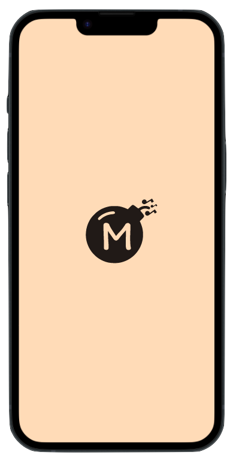

<p align="center">
  <!-- Light Mode for Maxaboom logo -->
  <a href="https://abraham-ukachi.students-laplateforme.io/boutique-en-ligne/#gh-light-mode-only" target="_blank">
     
  </a>

  <!-- Light Mode for Maxaboom logo -->
  <a href="https://abraham-ukachi.students-laplateforme.io/boutique-en-ligne/#gh-dark-mode-only" target="_blank">
     
  </a>

</p>

<p align="center">
  The number <strong>#1</strong>🏆 online store for all your sporting needs 🏃‍♂️ 🚴🏼‍♀️ 🧗🏼‍♀️. <br> MIT licensed and currently under development.
</p>

<p align="center">
    <a href="https://abraham-ukachi.students-laplateforme.io/boutique-en-ligne" target="_blank"><b>maxaboom &rarr;</b></a>
</p>

---

# `boutique-en-ligne`

> IMPORTANT: This is a working progress and subject to major changes until the specified deadline below.

A school project to create an **online shop** using `JavaScript` with a fully functioning `MySQL` database.

This project is to be done by a group of 3, and my partners / collaborators for the next three weeks are [Axel Vair](https://github.com/axel-vair) et [Morgane Marechal](https://github.com/morgane-marechal). 

So, we've decided to name our online shop 🥁... "**`MaxaBoom`**" (♾💥), and will a MySQL Database named **`???`**. 

**Why `MaxaBoom` you might ask?** #GoodQuestion !-: This is just a play-on-words with our first names and/or nicknames: *Ax*el + *Ab*raham + *Momo* (Morgane) === **MaxaBoom** 😜


The following tables (including a couple of TRIGGERS) were created in our **`??`** database:

- [*`users`*](#users---MySQL-Table): All currently registered users.
- [*`images`*](#images---MySQL-Table): All images used by this online shop.
- [*`products`*](#articles---MySQL-Table): All producs created by a seller.
- [*`categories`*](#categories---MySQL-Table): All categories of corresponding products.
- [*`tags`*](#tags---MySQL-Table): All tags of corresponding products.
- [*`saves`*](#saves---MySQL-Table): All saves of corresponding products.
- [*`comments`*](#comments---MySQL-Table): All comments of corresponding products.

> NOTE: For more info, [read the Database section](#Database) of this *README*. 


## Description 
> Original text in French:  


## Requirements

These are a couple of the main requirements for this school project:

1. **A home page**: 


> NOTE:  

## Target Skills

- 

## Jobs
> MOTTO: We'll always do [**more**](#More) 😜

The official deadline of the jobs below - according to [intra](https://intra.laplateforme.io) - is **26-04-2023 at 09:25 A.M**. Here is a list of all the specific files to be submitted as well as their corresponding / current **status** for this project:

| No. | Name | File | Status |
|:----|:-----|:-----|:-------|
| 1 | *`Splash - Screen`* | **splash.php** | Pending |
| 2 | *`Welcome - Screen`* | **welcome.php** | Pending |
| 3 | *`Home - Page`* | **index.php** | Pending |
| 4 | *`Peace & Love - Database - SQL`* | **???.sql** | Pending |

> WARNING: This list is a working progress and will change soon

> NOTE: (\*) = still needs to be updated


## Structure

The folder & file structure of this project:

- [**api**](./api/)
- - [**database**](./api/database/)
- - * *Database.php*
- - * *ResponseHandler.php*
- - * ...
- - [**user**](./api/user/)
- - * *User.php*
- - * *auth.php*
- - * ...
- - [**article**](./api/article/)
- - * *Article.php*
- - * ...
- - [**comment**](./api/comment/)
- - * *Comment.php*
- - * ...
- [**assets**](./assets/)
- - [**logos**](./assets/logos/)
- - [**images**](./assets/images/)
- - ...
- - [**animations**](./assets/animations/)
- - * *fade-in-animation.css*
- - * *pop-in-animation.css*
- - * *slide-from-down-animation.css*
- - [**theme**](./assets/theme/)
- - * *color.css*
- - * *typography.css*
- - * *styles.css*
- - [**stylesheets**](./assets/stylesheets/)
- - * *home-styles.css*
- - * *splash-screen-styles.css*
- - * *login-styles.css*
- - * *register-styles.css*
- - * *profile-styles.css*
- [**src**](./src/)
- - *app.js*
- - *server.js*
- - ...
- - [**helpers**](./src/helpers/)
- - * *mediawatcher.js*
- - * *...*
- - [**scripts**](./src/screens/)
- - * *home.js*
- - * *checkout.js*
- - ...
- LICENSE
- README.md
- manifest.json
- package.json
- ...
- **index.php**
- **splash.php**
- **welcome.php**
- **???.sql**


> NOTE: This is just a looong snippet ;)


## More 

These are some of the things we did or plan to do, in addition to this project's [job requirements](#Requirements):

| No. | Name | File | Status |
|:----|:-----|:-----|:-------|
| 1 | *`Pop In - Animation`* | **pop-in-animation.css** | Pending |
| 2 | *`Fade In - Animation`* | **fade-in-animation.css** | Pending |
| 3 | *`Slide From Down - Animation`* | **slide-from-down-animation.css** | Pending |
| 4 | *`Slide From Up - Animation`* | **slide-from-up-animation.css** | Pending |
| 5 | *`Slide Left - Animation`* | **slide-left-animation.css** | Pending |
| 6 | *`Slide From Left - Animation`* | **slide-from-left-animation.css** | Pending |
| 7 | *`Slide Right - Animation`* | **slide-right-animation.css** | Pending |
| 8 | *`Slide From Right - Animation`* | **slide-from-right-animation.css** | Pending |


> NOTE: (\*) = still needs to be updated. <br>
> There's certainly a couple of file we must've forgot or not added yet, so we'll keep the above list updated obv. :)

## Database
> HEADS-UP: We do love me some TRIGGERS, so do not be shocked to see a couple in this database #LOL

The following tables were created in a MySQL database named **`???`** via [PDO](https://www.php.net/manual/en/class.pdo.php) on [phpmyadmin](http://localhost/phpmyadmin):


> NOTE: **`⨁`** = _FOREIGN_KEY_

### `users` - MySQL Table

This table has a [**one-to-many**](https://www.metabase.com/learn/databases/table-relationships#one-to-many-relationship) relationship with [*`products`*](#`todolists`---MySQL-Table).

| No. | Name | Type | Length | Null | Default | Extra |
|:----|:-----|:-----|:-------|:-----|:--------|:-------|
| 1 | *`id`* 🔑 | **INT** | 255 | No | None | **AUTO_INCREMENT** | 
| 2 | *`username`* | **VARCHAR** | 30 | No | None | - | 
| 3 | *`email`* | **VARCHAR** | 60 | No | None | - | 
| 4 | *`password`* | **VARCHAR** | 255 | No | None | - | 
| 5 | *`firstname`* | **VARCHAR** | 30 | No | None | - | 
| 6 | *`lastname`* | **VARCHAR** | 30 | No | None | - | 
| 7 | *`created_at`* | **DATETIME** | - | Yes | NULL | - |  


> NOTE: 


### `images` - MySQL Table

| No. | Name | Type | Length | Null | Default | Extra |
|:----|:-----|:-----|:-------|:-----|:--------|:-------|
| 1 | *`id`* 🔑  | **INT** | 255 | No | None | **AUTO_INCREMENT** |
| 2 | *`width`* | **TINYINT** | 5 | No | None | - |
| 3 | *`height`* | **TINYINT** | 5 | No | None | - |
| 4 | *`type`* | **VARCHAR** | 10 | No | None | - |
| 5 | *`blob`* | **MEDIUMBLOB** | 2000000 | No | None | - |


### `products` - MySQL Table

This table has a [**many-to-one**](https://www.metabase.com/learn/databases/table-relationships#many-to-one-relationship) relationship with [*`users`*](#`users`---MySQL-Table) table.

| No. | Name | Type | Length | Null | Default | Extra |
|:----|:-----|:-----|:-------|:-----|:--------|:-------|
| 1 | *`id`* 🔑  | **VARCHAR** | 30 | No | None | - |
| 2 | *`category_id`* ⨁ | **TINYINT** | 10 | No | None | - |
| 3 | *`author_id`* ⨁ | **INT** | 255 | No | None | - |
| 4 | *`cover_image_id`* ⨁ | **INT** | 255 | No | None | - |
| 5 | *`title`* | **VARCHAR** | 60 | No | None | - |
| 6 | *`text`* | **TEXT** | 2000 | No | None | - |
| 7 | *`likes`* | **INT** | 10 | Yes | NULL | - |
| 8 | *`created_at`*   | **DATETIME** | - | Yes | NULL | - |
| 9 | *`updated_at`*   | **DATETIME** | - | Yes | NULL | - |

> NOTE:


### `categories` - MySQL Table
> ⚠️  WARNING: This table may be used by one or more TRIGGERs from the `articles` table.

| No. | Name | Type | Length | Null | Default | Extra |
|:----|:-----|:-----|:-------|:-----|:--------|:-------|
| 1 | *`id`* 🔑  | **TINYINT** | 10 | No | None | **AUTO_INCREMENT** |
| 2 | *`name`* ⨁ | **INT** | 255 | No | None | - |
| 3 | *`image_id`* ⨁ | **INT** | 255 | Yes | NULL | - |

> NOTE:


### `tags` - MySQL Table
> ⚠️  WARNING: This table may contain one or more TRIGGERs

| No. | Name | Type | Length | Null | Default | Extra |
|:----|:-----|:-----|:-------|:-----|:--------|:-------|
| 1 | *`id`* 🔑  | **INT** | 255 | No | None | **AUTO_INCREMENT** |
| 2 | *`name`* ⨁ | **INT** | 255 | No | None | - |
| 3 | *`product_id`* ⨁ | **VARCHAR** | 30 | No | None | - |

> NOTE:


### `saves` - MySQL Table
> ⚠️  WARNING: This table may contain one or more TRIGGERs

| No. | Name | Type | Length | Null | Default | Extra |
|:----|:-----|:-----|:-------|:-----|:--------|:-------|
| 1 | *`id`* 🔑  | **INT** | 255 | No | None | **AUTO_INCREMENT** |
| 2 | *`user_id`* ⨁ | **INT** | 255 | No | None | - |
| 3 | *`product_id`* ⨁ | **VARCHAR** | 30 | No | None | - |
| 4 | *`saved_at`* | **DATETIME** | - | Yes | NULL | - |

> NOTE:


### `comments` - MySQL Table
> ⚠️  WARNING: This table may contain one or more TRIGGERs

| No. | Name | Type | Length | Null | Default | Extra |
|:----|:-----|:-----|:-------|:-----|:--------|:-------|
| 1 | *`id`* 🔑  | **INT** | 255 | No | None | **AUTO_INCREMENT** |
| 2 | *`user_id`* ⨁ | **INT** | 255 | No | None | - |
| 3 | *`text`* | **TEXT** | 500 | No | None | - |
| 4 | *`product_id`* ⨁ | **VARCHAR** | 30 | No | None | - |
| 5 | *`created_at`* | **DATETIME** | - | Yes | NULL | - |
| 6 | *`edited_at`*   | **DATETIME** | - | Yes | NULL | - |

> NOTE:


---

## Installation
> IMPORTANT: Make sure you have [`XAMPP`](https://www.apachefriends.org/) already installed on your computer before proceeding.

1. Clone this project's repository
```sh
git clone https://github.com/abraham-ukachi/boutique-en-ligne.git
```

> NOTE: There's no need to change the current working directory to **boutique-en-ligne**


2. Now, create a symbolic link of **boutique-en-ligne** in the `XAMPP`'s **htdocs** folder:

-   **On Mac**

```sh
ln -s "$(pwd)/boutique-en-ligne" /Applications/XAMPP/htdocs/boutique-en-ligne
```
-   **On Linux**

```sh
ln -s "$(pwd)/boutique-en-ligne" /opt/lampp/htdocs/boutique-en-ligne
```

3. Open the **boutique-en-ligne** folder in your default browser:

```sh
open http://localhost/boutique-en-ligne
```


---

## Testing

| Browser | Version | Status | Date | Time
|:--------|:--------|:-------|:-----|:-----
| *`Brave`* | **1.47.186** | - | - | -
| *`Chrome`* | **-** | *Pending* | - | -
| *`Firefox`* | **-** | *Pending* | - | -
| *`Safari`* | **-** | *Pending* | - | -
| *`Opera`* | **-** | *Pending* | - | -
| *`Edge`* | **-** | *Pending* | - | -
| *`IE`* | **-** | *Pending* | - | -

> NOTE: *`IE`* = Internet Explorer = 👎🏽


## TODOs

- [ ] Create a project-specific logo 
- [ ] Add localization / internationalization (at least: **english** & **french**)
- [ ] Add mobile compatibility to all pages (i.e. make it responsive)
- [ ] Optimize `.svg` doodles
- [ ] Optimize all `.php` files
- [ ] Optimize all `.css` files
- [ ] Optimize all `.js` files
- [ ] Remove unnecessary comments
- [ ] Add screenshots

---

## Some Random Screenshots


### On Mobile

| No. |Light Mode | Dark Mode | Note |
|:----|:-----------|:----------|:-----|
| 1. |  | N/A | Splash Screen - Mobile - Design Concept |
| 2. |  | N/A | Welcome Page - Mobile - Design Concept |
| 3. | N/A | N/A | - |


### On Laptop

| No. |Light Mode | Dark Mode | Note |
|:----|:----------|:----------|:-----|
| 1. |  | N/A | Splash Screen - Desktop - Design Concept |
| 2. |  | N/A | Welcome Page - Desktop - Design Concept |
| 3. | N/A | N/A | - |
